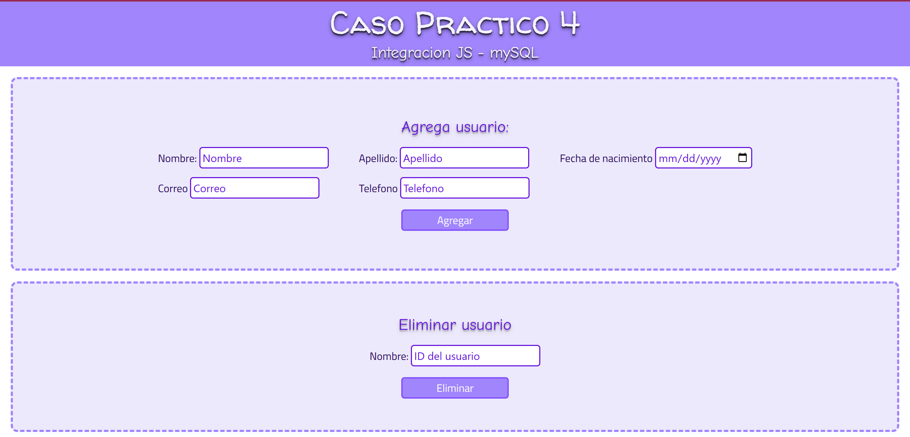
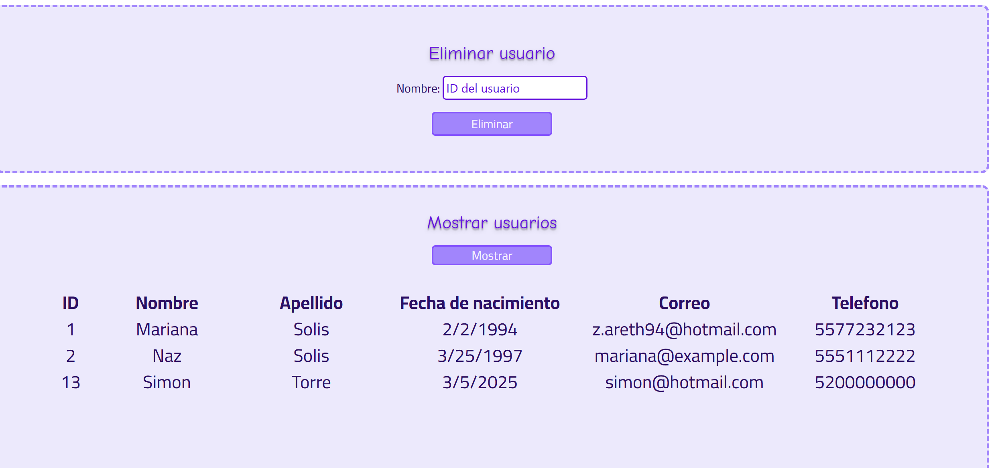

# CASO PRACTICO DEL MODULO 4
**autora: Solis Torres Mariana Nazaret**

## 1.-CREA LA BASE DE DATOS
Ejecutar el archivo ejemplo_db.sql para la creacion de la base de datos que se ocupara en el caso practico. 
Cambia los datos de la coneccion segun sean en tu caso:
    const connection = mysql.createConnection({
    host: "localhost",
    user: "root",
    password: "",
    database: "ejemplo_db",
    });

## 2.-CORRE EL API
Realiza las configuraciones necesarias y posteriormente abre la trerminal y colocate en la carperta apiJSMysql y ejecuta el comando *node conexion_db.js*

Si todo salio bien observaras un mensaje que diga 
*Servidor activo en el puerto 3000*
*Conexión a MySQL establecida*

## 3.-ABRE index.html CON LIVE SERVER
Esto te mostrara la pagina del caso practico 4 donde podras:
- Agrega un usuario
- Eliminar usuario
- Mostar usuarios

