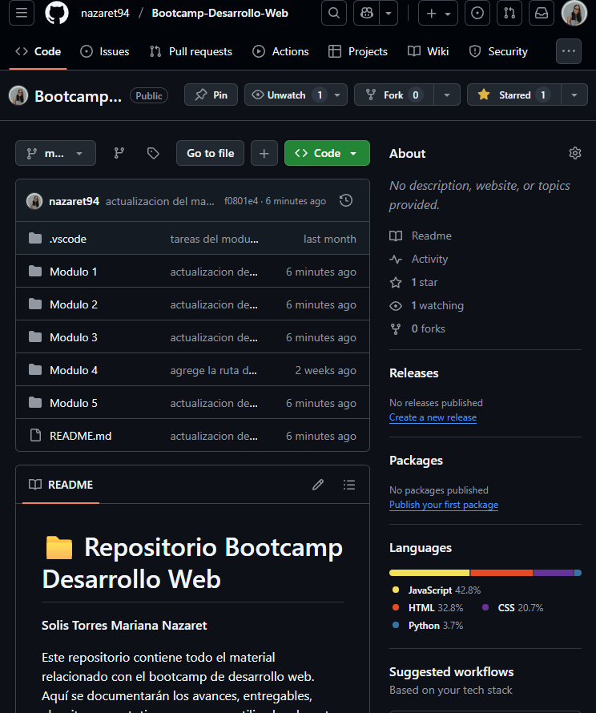
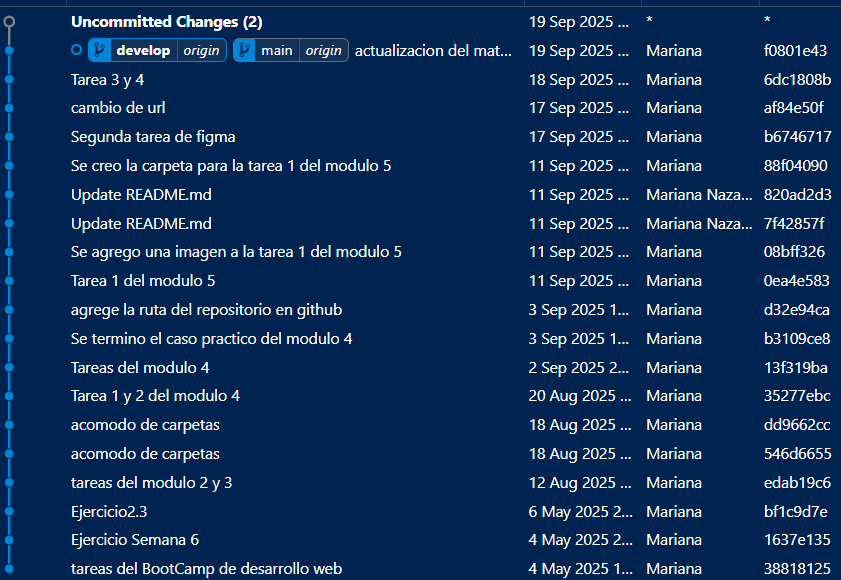
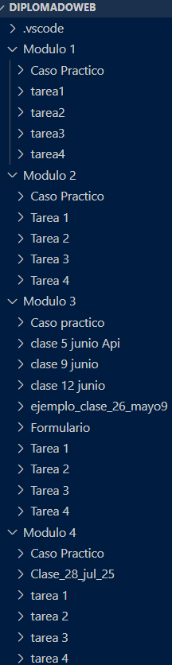
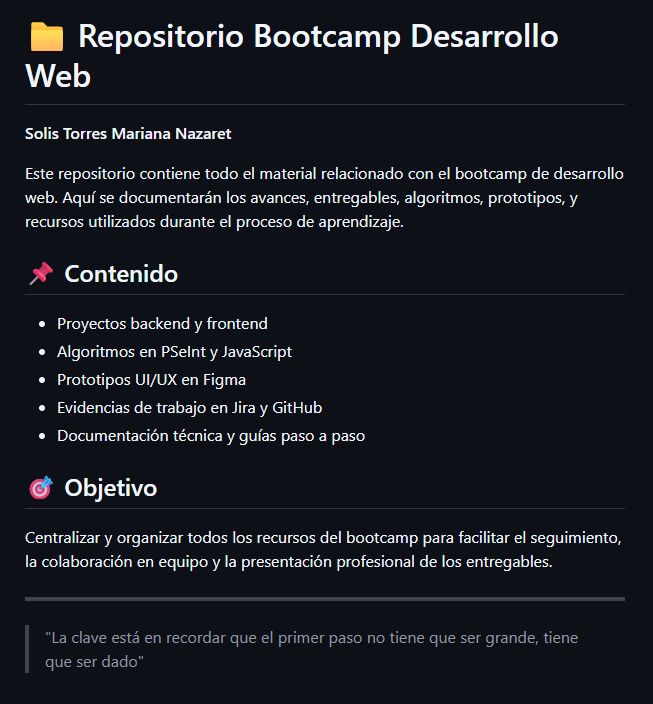
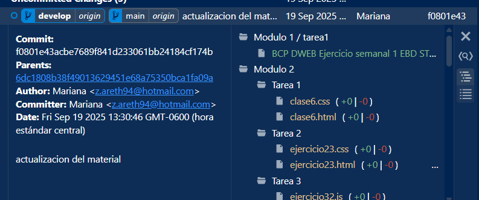

# Modulo 5 - Caso practico 
**Solis Torres Mariana Nazaret**

## Ingeración de código

Crear un repositorio nuevo con el nombre bootcampWeb

Crea la estructura de ramas de acuerdo al Git Flow (main, develop)

Crear una carpeta por cada un de las clases hasta la fecha, nombrarlas como clase1, clase2, etc. una de ellas el material de las practicas semanales.(diagramas de flujo, código de las prácticas semanales previamente realizado).

Crear un archivo .md en el cual describan el propósito de su repositorio (ejemplo: Este repositorio contendrá todo el material del bootcamp de desarrollo web).

Realizar un commit con un mensaje descriptivo sobre el la acción a realizar y hacer push del material hacia el repositorio

Agregar una line extra al final del archivo .md que incluya tu frase favorita al final del archivo

