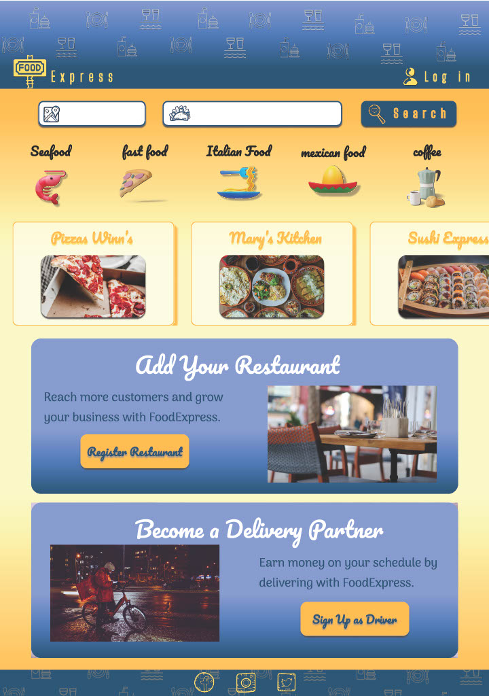

# Modulo 5 - Tarea # 1 
**Solis Torres Mariana Nazaret**

## - Objetivo
Poner en práctica lo aprendido en el programa de diseño de interfaces de Figma

## - Contexto
Una empresa de entrega de comida a domicilio llamada
FoodExpress está buscando actualizar su página web para mejorar la experiencia del usuario y aumentar las conversiones.

Quieren que la nueva página de inicio refleje la variedad de restaurantes disponibles, facilite la búsqueda de comida por tipo y ubicación, y anime a los usuarios a realizar pedidos de manera rápida y sencilla.

## - ContextoContexto
Introducción a la programación
Una empresa de entrega de comida a domicilio llamada
FoodExpress
está buscando actualizar su página web para
mejorar la experiencia del usuario y aumentar las conversiones.
Quieren que la nueva página de inicio refleje la variedad de
restaurantes disponibles, facilite la búsqueda de comida por tipo
y ubicación, y anime a los usuarios a realizar pedidos de manera
rápida y sencilla.

## - Instrucciones
Diseña un wireframe para la página de inicio del sitio web de FoodExpress, una empresa de entrega de comida a domicilio.

Puedes Investigar sobre los tipos de comida disponibles, las áreas de entrega y las características principales que los usuarios buscan al ordenar comida a domicilio. Piensa que es tu negocio de comida de entrega a domicilio.

Analiza las páginas web de otras empresas similares de entrega de comida a domicilio para obtener ideas y referencias.

Identifica los elementos esenciales que deben incluirse en la página de inicio, como un campo de búsqueda, categorías de comida, listado de restaurantes destacados, información sobre el proceso de pedido y opciones de registro o inicio de sesión para los usuarios.

## FIGMA
**https://www.figma.com/design/wWyRVqhbJN0E0KMxZtLor3/Modulo-5---FoodExpress?node-id=33-38&t=pqaFehUZmHNeSdCU-1**

**https://www.figma.com/proto/wWyRVqhbJN0E0KMxZtLor3/Modulo-5---FoodExpress?page-id=0%3A1&node-id=33-38&p=f&viewport=703%2C172%2C0.4&t=wJ42DDLSRrWOIt6t-1&scaling=scale-down-width&content-scaling=fixed**
