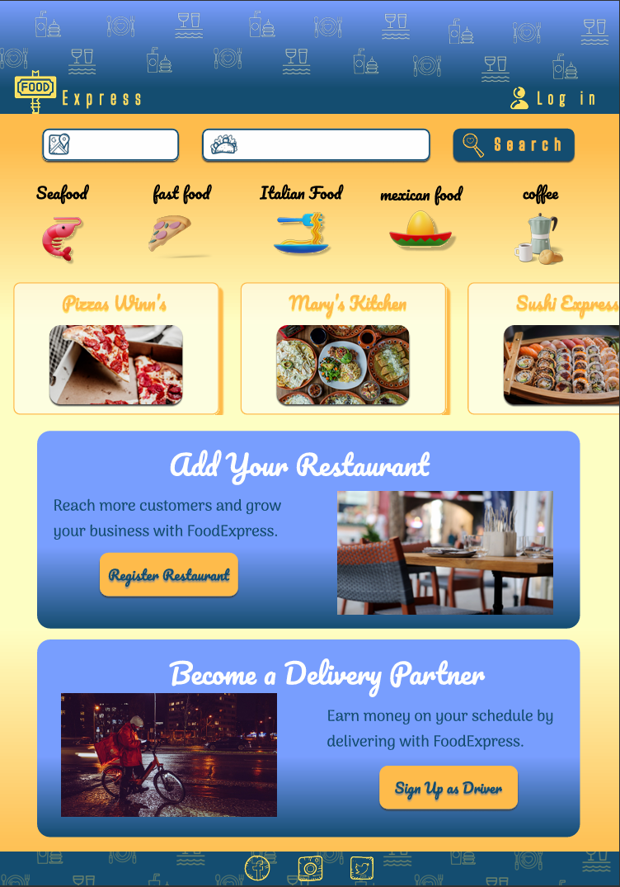
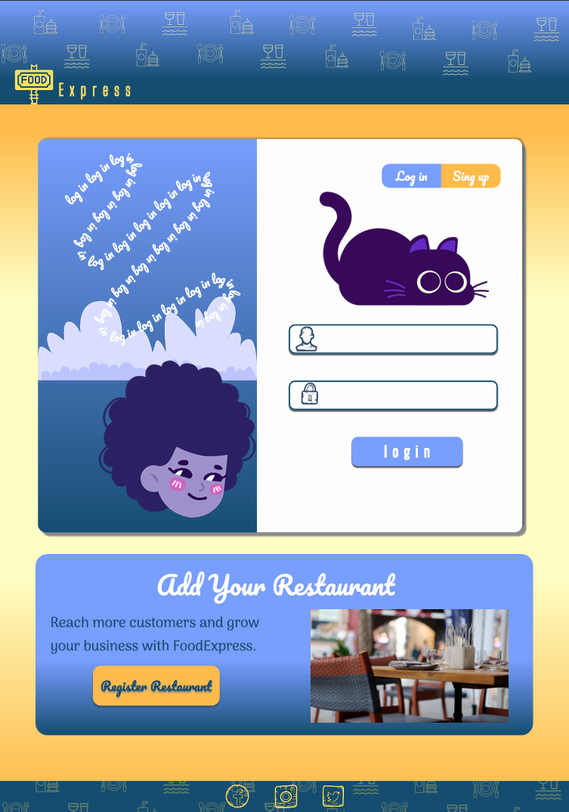
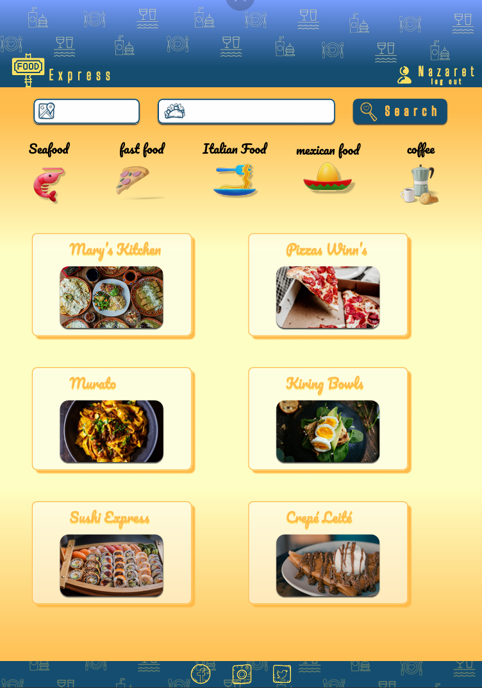

# Modulo 5 - Tarea # 2
**Solis Torres Mariana Nazaret**

## - Objetivo
Poner en práctica lo aprendido en el programa de diseño de interfaces de Figma para crear un prototipo navegable

## - Instrucciones
Haz uso de tu prototipo anterio para crearlo de forma
interactiva.

Debes de mostrar el uso de 2 funcionalidades de tu aplicación como mínimo

## - Contexto
Una empresa de entrega de comida a domicilio llamada
FoodExpress está buscando actualizar su página web para mejorar la experiencia del usuario y aumentar las conversiones.

Quieren que la nueva página de inicio refleje la variedad de restaurantes disponibles, facilite la búsqueda de comida por tipo y ubicación, y anime a los usuarios a realizar pedidos de manera rápida y sencilla.

## - Instrucciones
Diseña un wireframe para la página de inicio del sitio web de FoodExpress, una empresa de entrega de comida a domicilio.

Puedes Investigar sobre los tipos de comida disponibles, las áreas de entrega y las características principales que los usuarios buscan al ordenar comida a domicilio. Piensa que es tu negocio de comida de entrega a domicilio.

Analiza las páginas web de otras empresas similares de entrega de comida a domicilio para obtener ideas y referencias.

## FIGMA
**https://www.figma.com/design/REUqDfzIcST77kYSqqDBL1/Modulo-5---FoodExpress-prototipo?node-id=2001-3&t=MZn9xuElvgY0znRx-1**

**https://www.figma.com/proto/REUqDfzIcST77kYSqqDBL1/Modulo-5---FoodExpress-prototipo?page-id=2001%3A3&node-id=2015-216&viewport=216%2C310%2C0.5&t=WVHuGETN64SgQ1Pv-1&scaling=min-zoom&content-scaling=fixed&starting-point-node-id=2015%3A216**
